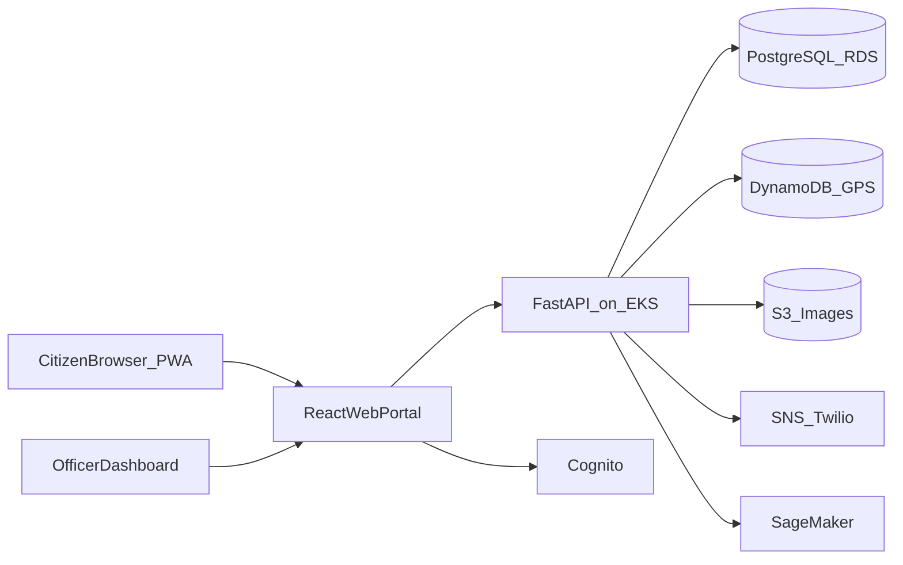

# Swachhata Abhiyan — Web Portal Docs Plan

## Context
Workspace currently has only [`DOCs/Swachata Abhiyan.pdf`](D:\Broadridge\DOCs\Swachata Abhiyan.pdf). No app code exists yet. Docs will be authored for a **web-based portal** (no Flutter/mobile app in v1). Citizens, field staff, and municipal officers all use the browser portal (responsive PWA for geo/camera on phones).

## Locked decisions
- **Clients:** React + TypeScript web portal (responsive + PWA for geo-tagged photo complaints)
- **Backend:** FastAPI (Python) — aligns with PyTest and AWS SageMaker/AI in the PDF
- **Data:** PostgreSQL (RDS) primary + DynamoDB for fast GPS/lookup caches + S3 for images
- **Auth:** AWS Cognito (roles: Citizen, Field Staff, Officer, Admin)
- **Deploy:** Docker → ECR → EKS; CI via GitHub Actions; GitOps via ArgoCD
- **Docs location:** [`DOCs/`](D:\Broadridge\DOCs) (keep existing PDF; add markdown guides beside it)

## Docs to create

| File | Purpose |
|------|---------|
| [`DOCs/README.md`](D:\Broadridge\DOCs\README.md) | Index/navigation for all guides |
| [`DOCs/01-OVERVIEW.md`](D:\Broadridge\DOCs\01-OVERVIEW.md) | Problem, goals, users, scope (web-only MVP) |
| [`DOCs/02-PLANNING.md`](D:\Broadridge\DOCs\02-PLANNING.md) | Epics, user stories, 8-sprint roadmap, roles, success metrics |
| [`DOCs/03-TECH-STACK.md`](D:\Broadridge\DOCs\03-TECH-STACK.md) | Locked stack, tools, why each choice |
| [`DOCs/04-ARCHITECTURE.md`](D:\Broadridge\DOCs\04-ARCHITECTURE.md) | System design, modules, data flow, AWS diagram |
| [`DOCs/05-SETUP.md`](D:\Broadridge\DOCs\05-SETUP.md) | Local/dev/cloud prerequisites and bootstrap steps |
| [`DOCs/06-IMPLEMENTATION-PLAN.md`](D:\Broadridge\DOCs\06-IMPLEMENTATION-PLAN.md) | Ordered build steps mapped to sprints/features |

Keep [`DOCs/Swachata Abhiyan.pdf`](D:\Broadridge\DOCs\Swachata Abhiyan.pdf) as the source problem statement; link it from the README.

## Content outline (what each doc will contain)

### 01 — Overview
- Background pain points from the PDF
- Product vision: single web portal for complaints, tracking, drives, analytics, rewards
- Personas: Citizen, Field Staff, Municipal Officer, Admin
- In-scope (web MVP) vs out-of-scope (native mobile, nationwide multi-tenant v1 stretch)

### 02 — Planning
- Epics from PDF: Complaints, Waste Collection, Cleanliness Drives, Analytics, Rewards
- Sample user stories per epic
- 2-week sprint plan (8 sprints) adapted for **web portal only**
- Definition of Done, UAT, launch checklist
- Jira/Confluence workflow notes

### 03 — Tech Stack
- Frontend: React 18+, TypeScript, Vite, React Router, TanStack Query, Map library (Leaflet/Mapbox), PWA
- Backend: FastAPI, SQLAlchemy/Alembic, Pydantic, Celery/Redis for async jobs
- DB/Storage: RDS PostgreSQL, DynamoDB, S3
- AI: SageMaker (hotspot prediction) — Sprint 6
- DevOps: GitHub, Actions, Docker, EKS, ArgoCD, Terraform, Prometheus/Grafana, ELK, SonarQube/Snyk
- Testing: Cypress (UI), Postman/pytest (API)

### 04 — Architecture
Mermaid high-level flow:

Modules: Auth, Complaints, Fleet/GPS, Drives/Volunteers, Analytics, Rewards, Notifications. Include ER sketch (users, wards, complaints, vehicles, routes, events, scores, rewards) and environment topology (dev/staging/prod).

### 05 — Setup (step-by-step)
1. Install Node 20+, Python 3.11+, Docker, AWS CLI, Terraform, kubectl
2. Clone repo layout (monorepo suggestion: `frontend/`, `backend/`, `infra/`)
3. Cognito + local env files
4. Start Postgres/Redis via Docker Compose
5. Run FastAPI + Alembic migrations
6. Run React Vite app
7. Seed wards/users
8. Optional: minikube/EKS notes for later sprints

### 06 — Implementation Plan (step-by-step build)
Ordered delivery matching adapted sprints:

1. **Sprint 1:** Infra skeleton (Terraform basics, Compose), auth + complaint API CRUD
2. **Sprint 2:** Portal UI — submit complaint with browser geolocation + image upload to S3; tracking status pages
3. **Sprint 3:** Vehicle GPS ingest API + map view for officers; route display
4. **Sprint 4:** Cleanliness drive scheduling, volunteer signup, certificates (PDF via S3)
5. **Sprint 5:** Ward/city scorecards dashboard
6. **Sprint 6:** Hotspot detection model hook (SageMaker) + schedule suggestions
7. **Sprint 7:** Points, leaderboards, campaigns
8. **Sprint 8:** Integration, Cypress/UAT, hardening, public launch

Each step will list concrete tasks, primary folders/services, and acceptance criteria.

## Execution approach (when you approve this plan)
- Write the 7 markdown files under `DOCs/` only — no application code in this pass
- Keep docs concise, actionable, and consistent with the locked web-portal stack
- Cross-link documents from `DOCs/README.md`

## Out of scope for this Docs pass
- Implementing the actual React/FastAPI application
- Creating GitHub repo structure beyond documenting the intended layout
- Native mobile / Flutter