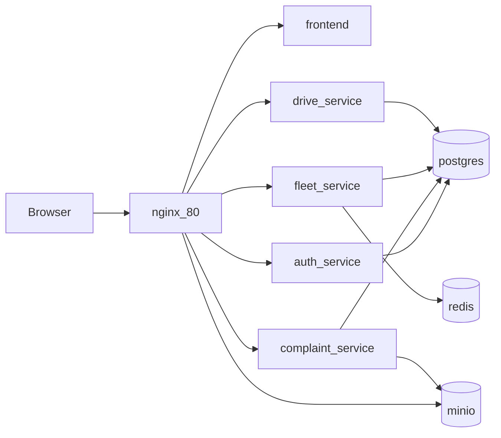
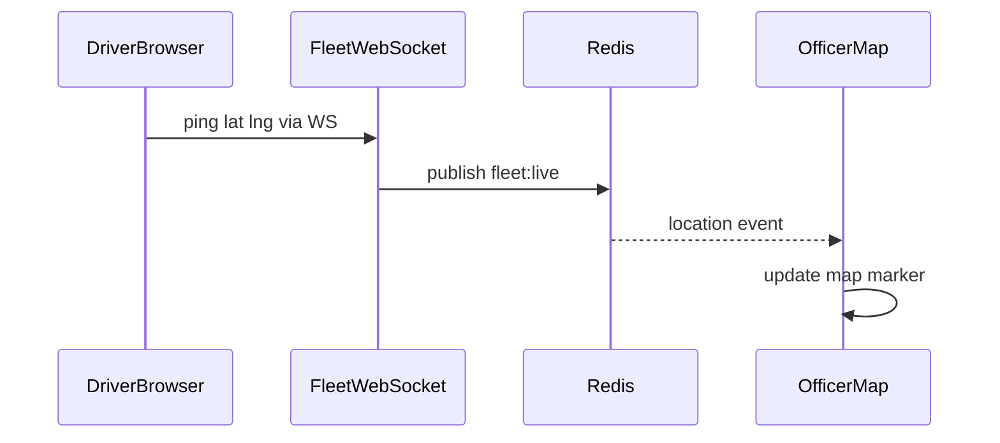

# 04 — Architecture (local Docker)

## High-level

## Live driver GPS

## Roles

- **citizen** — submit/track complaints, join drives
- **driver** — share phone GPS, update assigned complaints
- **officer / admin** — manage queue, watch live fleet, schedule drives

## Volumes & network

Compose defines bridge network `swachhata-net` and volumes: `postgres-data`, `redis-data`, `minio-data`, `auth-data`.

## Related docs

- [Tech Stack](./03-TECH-STACK.md)
- [Setup](./05-SETUP.md)
