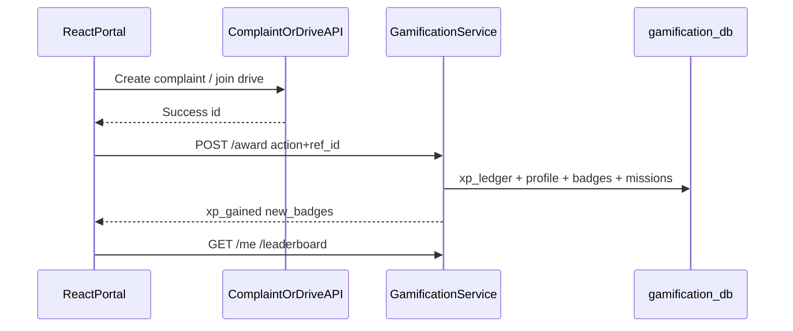

# 07 — Gamification Design & APIs

Added **without rewriting** existing auth/complaint/fleet/drive services. New microservice: `gamification-service`.

## Location APIs (fleet) — clarification

Vehicle tracking does **not** use a commercial GPS hardware API.

| API | Where | Role |
|-----|-------|------|
| W3C Geolocation | Driver browser | Source of lat/lng |
| `POST /api/fleet/location` | fleet-service | Persist ping |
| `WS /ws/fleet` | fleet-service | Live duplex channel |
| Redis `fleet:live` | redis | Pub/sub fan-out |
| Leaflet + OSM | frontend | Map rendering |

## Reward flow

## Progression tiers

| Tier | Approx XP |
|------|-----------|
| beginner | 0 |
| contributor | 200 |
| champion | 800 |
| hero | 2000 |
| legend | 5000 |

## Schema (core tables)

- `player_profiles` — xp, points, level, tier, streaks  
- `xp_ledger` — idempotent awards (`user_id, action, ref_type, ref_id`)  
- `badges` / `user_badges`  
- `missions` / `mission_progress`  
- `challenges`  
- `reward_items` / `redemptions`  
- `game_notifications`  
- `ward_scores`  

## REST (via nginx `/api/gamification/`)

| Method | Path | Description |
|--------|------|-------------|
| GET | `/health` | Health |
| GET | `/me` | Profile |
| POST | `/checkin` | Daily login XP |
| POST | `/award` | Award XP for action |
| GET | `/badges` | Badge catalog + earned |
| GET | `/missions` | Mission progress |
| GET | `/challenges` | Active challenges |
| GET | `/store` | Redeemable items |
| POST | `/store/redeem` | Spend points |
| GET | `/leaderboard?scope=city\|ward\|role` | Rankings |
| GET | `/leaderboard/wards` | Ward competition |
| GET | `/notifications` | Alerts |
| POST | `/notifications/read-all` | Mark read |

## UI

Route: `/app/rewards` — Overview, Badges, Missions, Store, Leaderboard, Alerts. Dark mode toggle in shell.

## Related

- [Setup](./05-SETUP.md)
- [Architecture](./04-ARCHITECTURE.md)
- Root [README](../README.md)
