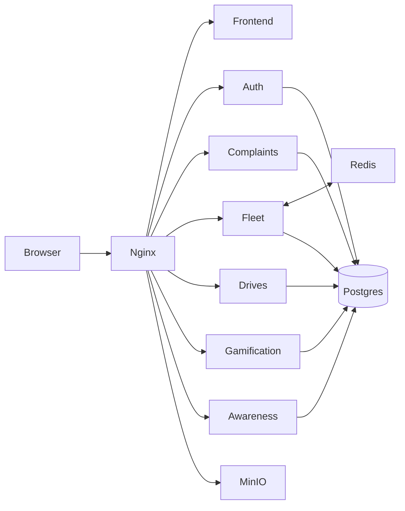

# Swachhata Abhiyan Digital Platform

Production-oriented **local Docker microservice** web portal for cleanliness complaints, **driver phone GPS** live fleet tracking, volunteer drives, and **gamification** (XP, badges, missions, store, leaderboards).

> **Out of scope for this phase:** AWS/cloud, AI/ML, advanced GitOps.  
> Stack stays **React (Vite) + FastAPI microservices + PostgreSQL + nginx** — existing services were **not rewritten**; gamification was **added** as a new service.

---

## How to run (start here)

### Prerequisites
- [Docker Desktop](https://www.docker.com/products/docker-desktop/) running
- Git

### Start the platform

**PowerShell (Windows):**

```powershell
cd D:\Broadridge
copy .env.example .env
docker compose up --build
```

**Detached (background):**

```powershell
cd D:\Broadridge
copy .env.example .env
docker compose up --build -d
```

Open: **http://localhost**  
Only **port 80** is published (nginx). Backend ports are internal.

### Stop the platform

**If running in the foreground** (logs in the terminal): press `Ctrl+C`, then:

```powershell
cd D:\Broadridge
docker compose down
```

**If running detached (`-d`):**

```powershell
cd D:\Broadridge
docker compose down
```

| Command | What it does |
|---------|----------------|
| `docker compose up --build` | Build images and start all services (logs in terminal) |
| `docker compose up --build -d` | Same, but in the background |
| `docker compose down` | Stop and remove containers (keeps DB volumes) |
| `docker compose down -v` | Stop and also delete volumes (wipes Postgres/Redis/MinIO data) |
| `docker compose stop` | Stop containers only (keep them for a quick restart) |
| `docker compose start` | Restart previously stopped containers |
| `docker compose ps` | Show running service status |
| `docker compose logs -f` | Follow logs for all services |

### Landing flow
1. Full marketing landing (sticky nav, 3D city hero, stats, problem, how-it-works, bento features, dashboard preview, leaderboard, testimonials, CTA, footer)  
2. **Login / Report** opens role picker → demo credentials → app  
3. Left sidebar sections · top-right profile · middle dashboard  

**Stack note:** Vite + React (not Next.js). Three.js / R3F for 3D, Framer Motion, shadcn-style UI, Recharts, Leaflet.

### Role access
| Role | Rewards | Live map | Complaints |
|------|---------|----------|------------|
| Citizen / Driver | Yes | View (+ driver shares GPS) | File + history |
| Officer / Admin | No | View + review | Review / assign / resolve |

### Demo accounts

| Role | Email | Password |
|------|-------|----------|
| Citizen | citizen@example.com | citizen123 |
| Driver | driver@example.com | driver123 |
| Officer | officer@example.com | officer123 |
| Admin | admin@example.com | admin123 |

### If `docker compose up --build` fails with Docker Hub `EOF`
Docker Hub may be blocked/unstable. Images are pulled from **AWS Public ECR** instead:

```powershell
docker pull public.ecr.aws/docker/library/node:20-alpine
docker pull public.ecr.aws/docker/library/python:3.12-slim
docker compose up --build
```

Dockerfiles already use `public.ecr.aws/docker/library/...` base images.

---

## Location / fleet — which APIs?

**No Google Maps GPS device API and no IoT tracker.** Tracking uses:

| Layer | Technology | Purpose |
|-------|------------|---------|
| Browser | **Geolocation API** (`navigator.geolocation.watchPosition`) | Driver phone lat/lng |
| Realtime | **Native WebSocket** `/ws/fleet` (FastAPI) | Live stream to officers |
| Fan-out | **Redis Pub/Sub** channel `fleet:live` | Broadcast latest positions |
| REST | `POST /api/fleet/location`, `GET /api/fleet/live` | Persist + snapshot |
| Map UI | **Leaflet + OpenStreetMap** tiles | Display trucks on map |

Flow: Driver browser → WebSocket/REST → fleet-service → Redis → Officer map via WebSocket.

---

## Architecture (microservices)



```text
Browser ──► nginx:80
              ├── /                     → frontend (React SPA)
              ├── /api/auth/            → auth-service
              ├── /api/complaints/      → complaint-service
              ├── /api/fleet/           → fleet-service
              ├── /ws/fleet             → fleet-service (WebSocket + Upgrade headers)
              ├── /api/drives/          → drive-service (+ public fund ledger)
              ├── /api/gamification/    → gamification-service (+ wallet stub)
              ├── /api/awareness/       → awareness-service (committees/campaigns)
              └── /media/               → MinIO
```

| Service | DB | Responsibility |
|---------|----|----------------|
| auth-service | `auth_db` | Register/login JWT + roles |
| complaint-service | `complaint_db` | Complaints + SLA + MinIO images |
| fleet-service | `fleet_db` + Redis | Vehicles + live driver GPS WebSocket |
| drive-service | `drive_db` | Events / volunteers / fund ledger |
| **gamification-service** | **`gamification_db`** | XP, badges, missions, store, wallet payout stub |
| **awareness-service** | **`awareness_db`** | Committees, campaigns, calendar, scorecards |

Network: `swachhata-net` · Volumes: `postgres-data`, `redis-data`, `minio-data`

---

## Gamification (what was added)

### Progression
`Beginner → Contributor → Champion → Hero → Legend` (by XP)  
Levels scale with XP; redeemable **points** power the store.

### Point examples
| Action | XP |
|--------|----|
| Daily login | +5 |
| Complaint submitted | +10 |
| Complaint verified/assigned | +20 |
| Issue resolved | +40 |
| Volunteer event | +50 |
| Weekly streak (every 7 days) | +50 |

### Features in UI (`/app/rewards`)
- Profile XP bar, streaks, tier chips  
- Badges (10 seeded)  
- Daily / weekly / monthly missions  
- Community & ward challenges  
- Reward store (coupons, certificates, digital badges)  
- City + ward leaderboards  
- In-app gamification notifications  

Existing complaint/drive pages **call** `/api/gamification/award` after success (additive hooks only).

### Key APIs
- `GET /api/gamification/me`
- `POST /api/gamification/checkin`
- `POST /api/gamification/award`
- `GET /api/gamification/badges|missions|challenges|store|leaderboard|notifications`
- `POST /api/gamification/store/redeem`

---

## Frontend notes

- React + TypeScript + Vite + Tailwind  
- shadcn-style primitives + Framer Motion (Magic UI–style)  
- Dark mode toggle in header  
- Maps: Leaflet / OSM  

> The long enterprise brief mentioned Next.js + Express + Prisma. **This repo intentionally keeps the current FastAPI microservice stack** and adds gamification without a rewrite. A future migration doc can cover Next/Express if required.

---

## Project layout

```text
Broadridge/
  docker-compose.yml
  nginx/nginx.conf
  scripts/init-databases.sql
  frontend/                 # React SPA
  services/
    auth-service/
    complaint-service/
    fleet-service/
    drive-service/
    gamification-service/   # NEW
  DOCs/                     # planning + design docs
```

---

## Docs index

See [`DOCs/README.md`](./DOCs/README.md) and [`DOCs/07-GAMIFICATION.md`](./DOCs/07-GAMIFICATION.md).

---

## Troubleshooting

| Issue | Fix |
|-------|-----|
| Port 80 in use | Stop other local web servers or change nginx host mapping |
| Gamification 500 / DB missing | `docker compose exec postgres psql -U swachh -c "CREATE DATABASE gamification_db;"` then restart gamification service |
| Login email invalid | Use `@example.com` demos (not `.local`) |
| Map empty | Driver must click **Start sharing location** and allow GPS |
| Frontend old UI | `npm run build` in `frontend/` then `docker compose up --build -d frontend nginx` |
| WebSocket 403 / stuck connecting | Rebuild fleet + reload nginx; UI shows Connected / Reconnecting (attempt N). REST `/api/fleet/live` still works as fallback |
| `awareness_db` missing | `docker compose exec postgres psql -U swachh -d postgres -c "CREATE DATABASE awareness_db;"` then `docker compose restart awareness-service` |
| Drive `budget_allocated` missing | `docker compose exec postgres psql -U swachh -d drive_db -c "ALTER TABLE drive_events ADD COLUMN IF NOT EXISTS budget_allocated DOUBLE PRECISION DEFAULT 0;"` then restart drive-service |
